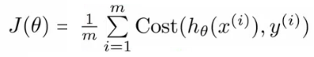

<html><head><meta content="text/html; charset=UTF-8" http-equiv="content-type"></head><body class="c32">
CSI5149 Project 2 Report - Classification

Shaughn Finnerty

6300433

March 27, 2016

<a class="c30" href="#h.5vhb0olotq4i">Running Instructions</a>

<a class="c30" href="#h.q6joo8g7jalu">Install Dependencies</a>

<a class="c30" href="#h.16mwojlb5u8o">Running Instructions</a>

<a class="c30" href="#h.bfjk5ikdl62d">Description &amp; Discussion of Model &amp; Algorithms</a>

<a class="c30" href="#h.e70rqjtbdvc0">K-Nearest-Neighbour</a>

<a class="c30" href="#h.nmeclzmdbte2">Gaussian Naive Bayes</a>

<a class="c30" href="#h.tz86zfd6k1i">Kernel Density Estimate w/ Naive Bayes</a>

<a class="c30" href="#h.ny6xd22poiqt">Logistic Regression</a>

<a class="c30" href="#h.929f25u6l3w6">Results</a>

<a class="c30" href="#h.z7b0urula70d">References</a>

<h1 class="c0 c17" id="h.5vhb0olotq4i">Running Instructions</h1><h2 class="c0 c17" id="h.q6joo8g7jalu">Install Dependencies</h2>

To run this project, you will need the following dependencies install

<ul class="c21 lst-kix_ujvhvsh96a1z-0 start"><li class="c0 c37 c26">Python 2.7</li><li class="c0 c37 c26">numpy&nbsp;for matrix operations (i.e. computing the transpose of feature matrices and parameter matrices)</li></ul><ul class="c21 lst-kix_ujvhvsh96a1z-1 start"><li class="c28 c0">`pip install numpy`</li><li class="c0 c28">http://docs.scipy.org/doc/numpy-1.10.1/user/install.html</li></ul><ul class="c21 lst-kix_ujvhvsh96a1z-0"><li class="c0 c26 c37">scipy for optimization methods (i.e. minimizing the cost function in the logistic regression classifier)</li></ul><ul class="c21 lst-kix_ujvhvsh96a1z-1 start"><li class="c28 c0">`pip install scipy`</li></ul>

As seen the pip package manager for python is the best tool to install these dependencies. This package manager can be installed by following the instructions here @ https://pip.pypa.io/en/stable/installing/ (downloading a python file and executing it)

When this is downloaded you can use the `requirements.txt` file to handle all the dependences that need to be installed by running the following command from within the project directory:

`pip install -r requirements.txt`

If you have already ran the pip install commands for each dependency separately, there is no need to perform this command.

Note: We have used numpy and scipy only for the functions that would otherwise be available natively in MatLab (transposition, minimization) and requested permission from the professor before attempt. These are only used in the logistic regression classifier. We have not utilized pre-existing classification algorithms from libraries like Scikit-Learn.

<h2 class="c0 c17" id="h.16mwojlb5u8o">Running Instructions</h2>

To run the project and generate results for the K-Nearest-Neighbour classifier, run the following command:

`python run.py --knn`

This will train and test the K Nearest Neighbour classifier on all datasets. Furthermore, you can evaluate the other classifiers by running:

`python run.py --gnb`

`python run.py --kde`

`python run.py --lr`

To run the Gaussian Naive Bayes classifier, the Kernel Density Estimate Naive Bayes classifier, and the Logistic regression classifier, respectively. To run ALL of the classifiers one after the other, use the command:

`python run.py --all`

The project has come with the CSV results in the `./results` directory in case you decide not to run them all (as some classifiers will take time to train and test, especially on the larger datasets).

Note: The Gaussian Naive Bayes algorithm will execute in the fastest time. You may will need to wait a fairly extended time for the other algorithms to train and test their models.
<h1 class="c0 c17" id="h.bfjk5ikdl62d">Description &amp; Discussion of Model &amp; Algorithms</h1>

<h2 class="c0 c17" id="h.e70rqjtbdvc0">K-Nearest-Neighbour</h2>

With K-Nearest-Neighbour, the initial model is created from the training data (e.g. 80% of the observations in the provided dataset) by simply transforming the matrix of n features * m observations/items to an easily accessible list/array of vectors, each of which containing the data points for each m features, and the class to which the observation belongs. &nbsp;While there is no parameters to be learned in this model (since it is purely memory-based), the transformation of data allows the list of vectors to be iterated for every classification required in the test phase. 

To classify a new observation with &ldquo;unknown&rdquo; class, we simply take the feature values for that item in a vector and compute the euclidian distance (note: other distance measures can be used) to the vectors initially created for each observed/training item available. We then sort the list of vectors based on increasing distance. The intuition behind this is that vectors in the training observations that have feature values closer (smaller distance) to those in the unknown item to be classified are likely to have a similar class to the unknown. We then take the first k closest training items (e.g. in our simulations we chose 51), and count the items that belong to class_1 and those that belong to class_2. The class having the most items in the k nearest neighbours is then assigned to be the class of the unknown item (majority vote). Note: Since we are using binary classification, it is useful to choose an odd K to avoid a case where there are an equal amount of items belong to both classes in the first k neighbours.

As you will see, this model and algorithm led to the best classification results, achieving &gt; 90% accuracy on all datasets. As such I chose to highlight this algorithm as the best algorithm&nbsp;for the project as it provided the best accuracy.

The one shortfall was that on large datasets (with large amounts of neighbours to compare to and distances to compute), the computation can take a long time. In future work it would be interesting to experiment with feature selection. That is, as part of the training process, we could identify features that have the most &ldquo;influence&rdquo; when determining the class, and use only these features when computing the distance. Although this would not reduce the amount of neighbours that need to be compared, it would reduce the amount of computations that need to occur when calculating the euclidian distance between the vectors as we would only need to account for the best selected features.

Before implementing the KNN classifier, other models/algorithms were implemented in hopes to achieve desired accuracy, but did not prove to perform as well as KNN. However, it is a useful exercise to report on the models/algorithms implemented.
<h2 class="c0 c17" id="h.nmeclzmdbte2">Gaussian Naive Bayes</h2>

In this generative model/algorithm, we use a Bayesian approach to produce a function: &nbsp;where X is the observed item, and Y is the class. This is achieved in the training phase by assuming that each feature in each class in the training items are identically and independently distributed according to a Gaussian Distribution. To create this model, we first calculate the mean and standard deviation for each feature in each class (using values observed from each training item in their respective class). &nbsp;With these parameters, we can then classify/test new unknown items by computing the product of the values of the Gaussian Probability Density Function for each feature in each class. &nbsp;For example to compute the probability that the unknown item X belonged to class 1, we calculated:

Where N is the amount of features which were all assumed to be iid according to a Gaussian distribution for each class.

A similar probability was calculated for class 2. Of the two, the class with the highest probability calculated was the class to which the unknown item was assigned.

<h2 class="c0 c17" id="h.tz86zfd6k1i">Kernel Density Estimate w/ Naive Bayes</h2>

It was thought that the features might not be distributed normally, so we hoped that we could compute a Kernel Density Estimate of the continuous distribution for each feature in each class might improve the performance. This was performed by computing the average of Gaussians with mean set to every possible continuous value for a given feature observed in the training data (so multiple Gaussian density functions had to be evaluated for each feature, rather than a single one using the computed mean and standard deviation in training). &nbsp;That is, given a value , its density estimate for class 1 became:

Where M is the amount of observations for the feature whose continuous distribution is being estimated with a Gaussian kernel.

This density estimate was then used in the product computed similar to above in the Gaussian Naive bayes classifier for each feature to compute a probability for each class. The selected class was determined by a similar distinction (i.e. the product of estimated distribution functions that evaluated to provide the highest probability). This technique to use a kernel density estimate of the continuous distribution for each feature was inspired by the Flexible Naive Bayes model presented by John and Langley (1995).

Unfortunately, we did not see any noticeable increase in performance using this kernel density estimate for the distribution of each feature in Naive Bayes. One possible hypothesis is that the data for each feature was in fact normally distributed, and thus, the estimation yielded a distribution that was very similar. This would explain why the accuracy results are very similar between the tests run for each algorithm.

The results from this algorithm did not show any significant benefit to using the algorithm. In fact, since we had to compute Gaussians for every feature value, and store these feature values as parameters (John and Langley, 1995), the increased storage and processing required made it less favorable than the Gaussian Naive Bayes for this particular problem (where we just had to store and process the initially computed expected values and standard deviations for each feature).
<h2 class="c0 c17" id="h.ny6xd22poiqt">Logistic Regression </h2>

The logistic regression classifier allowed us to experiment with creating a discriminative classifier. Compared to a generative classifier with the Naive Bayes, this models the conditional probability of a class y given an observed item to be classified x.

In a logistic regression classifier, our hypothesis representation is defined using the sigmoid function with the product of our transposed parameter vector &nbsp;and feature vector as:

And since we are solving a binary classification, our model then becomes:

To fit/estimate the parameters, , for our hypothesis function, we define a cost function that will be minimized using the training data. By minimizing this cost function over all parameters, &nbsp;we get the parameters least amount of error for our hypothesis function on our training. Depending on the true value of the class (y) for a given training item, the cost function is defined like so:

<h1 class="c0 c17 c25" id="h.nwl3kyokuiy"></h1>
As you can see, the cost function increases when our hypothesis function provides an hypothesized class value that is further away from the true (known) class of the item.

This cost function is used on all items in the set of training data to estimate all parameters &nbsp;for each feature. &nbsp;When training, we use the `scipy.optimize.fmin` method to minimize the following function and provide the minimized parameter vector to be used for further classification in the testing phase:

Where m is the number of items in the training dataset.

The `scipy.optimize.fmin` function was useful for minimizing the above function and determining the best-fit parameters. This function minimizes a given function using the downhill simplex algorithm (only using function values, not derivatives or second derivatives). A useful exercise would be to implement the gradient descent method to minimize this function. However, for the sake of time, the ma

One problem that we ran into on larger datasets is that when minimizing, the parameters would converge to a point where the hypothesis function would produce 0 values within the logarithmic function used in the cost function. To account for this domain error, we added an very small epsilon value () to the cost function so that it would not raise an error during execution. 

<h1 class="c0 c17" id="h.929f25u6l3w6">Results</h1>

Each table provides a summary of testing in a 4:1 ratio of training items to testing items on the datasets provided for this project.

We have ordered the results based on which classifier performed best in the experiments.

<table class="c7"><tbody><tr class="c35"><td class="c11" colspan="7" rowspan="1">
Results from K-Nearest-Neighbour Classifier Training &amp; Testing, K=51
</td></tr><tr class="c4"><td class="c19" colspan="1" rowspan="1">
Dataset Name
</td><td class="c22" colspan="1" rowspan="1">
Total Items in Dataset
</td><td class="c2" colspan="1" rowspan="1">
# Of Items In Training Dataset
</td><td class="c6" colspan="1" rowspan="1">
# Of Items In Test Dataset
</td><td class="c14" colspan="1" rowspan="1">
Correct Predictions
</td><td class="c14" colspan="1" rowspan="1">
Incorrect Predictions
</td><td class="c15" colspan="1" rowspan="1">
Accuracy
</td></tr><tr class="c4"><td class="c19" colspan="1" rowspan="1">
classify_d3_k2_saved1.mat
</td><td class="c22" colspan="1" rowspan="1">
2000
</td><td class="c2" colspan="1" rowspan="1">
1600
</td><td class="c6" colspan="1" rowspan="1">
400
</td><td class="c14" colspan="1" rowspan="1">
381
</td><td class="c14" colspan="1" rowspan="1">
19
</td><td class="c15" colspan="1" rowspan="1">
0.9525
</td></tr><tr class="c4"><td class="c19" colspan="1" rowspan="1">
classify_d3_k2_saved2.mat
</td><td class="c22" colspan="1" rowspan="1">
2000
</td><td class="c2" colspan="1" rowspan="1">
1600
</td><td class="c6" colspan="1" rowspan="1">
400
</td><td class="c14" colspan="1" rowspan="1">
394
</td><td class="c14" colspan="1" rowspan="1">
6
</td><td class="c15" colspan="1" rowspan="1">
0.985
</td></tr><tr class="c4"><td class="c19" colspan="1" rowspan="1">
classify_d3_k2_saved3.mat
</td><td class="c22" colspan="1" rowspan="1">
2000
</td><td class="c2" colspan="1" rowspan="1">
1600
</td><td class="c6" colspan="1" rowspan="1">
400
</td><td class="c14" colspan="1" rowspan="1">
399
</td><td class="c14" colspan="1" rowspan="1">
1
</td><td class="c15" colspan="1" rowspan="1">
0.9975
</td></tr><tr class="c4"><td class="c19" colspan="1" rowspan="1">
classify_d4_k3_saved1.mat
</td><td class="c22" colspan="1" rowspan="1">
2000
</td><td class="c2" colspan="1" rowspan="1">
1600
</td><td class="c6" colspan="1" rowspan="1">
400
</td><td class="c14" colspan="1" rowspan="1">
375
</td><td class="c14" colspan="1" rowspan="1">
25
</td><td class="c15" colspan="1" rowspan="1">
0.9375
</td></tr><tr class="c4"><td class="c19" colspan="1" rowspan="1">
classify_d4_k3_saved2.mat
</td><td class="c22" colspan="1" rowspan="1">
2000
</td><td class="c2" colspan="1" rowspan="1">
1600
</td><td class="c6" colspan="1" rowspan="1">
400
</td><td class="c14" colspan="1" rowspan="1">
363
</td><td class="c14" colspan="1" rowspan="1">
37
</td><td class="c15" colspan="1" rowspan="1">
0.9075
</td></tr><tr class="c4"><td class="c19" colspan="1" rowspan="1">
classify_d5_k3_saved1.mat
</td><td class="c22" colspan="1" rowspan="1">
2000
</td><td class="c2" colspan="1" rowspan="1">
1600
</td><td class="c6" colspan="1" rowspan="1">
400
</td><td class="c14" colspan="1" rowspan="1">
389
</td><td class="c14" colspan="1" rowspan="1">
11
</td><td class="c15" colspan="1" rowspan="1">
0.9725
</td></tr><tr class="c4"><td class="c19" colspan="1" rowspan="1">
classify_d5_k3_saved2.mat
</td><td class="c22" colspan="1" rowspan="1">
2000
</td><td class="c2" colspan="1" rowspan="1">
1600
</td><td class="c6" colspan="1" rowspan="1">
400
</td><td class="c14" colspan="1" rowspan="1">
373
</td><td class="c14" colspan="1" rowspan="1">
27
</td><td class="c15" colspan="1" rowspan="1">
0.9325
</td></tr><tr class="c4"><td class="c19" colspan="1" rowspan="1">
classify_d99_k50_saved1.mat
</td><td class="c22" colspan="1" rowspan="1">
3960
</td><td class="c2" colspan="1" rowspan="1">
3168
</td><td class="c6" colspan="1" rowspan="1">
792
</td><td class="c14" colspan="1" rowspan="1">
789
</td><td class="c14" colspan="1" rowspan="1">
3
</td><td class="c15" colspan="1" rowspan="1">
0.99621
</td></tr><tr class="c4"><td class="c19" colspan="1" rowspan="1">
classify_d99_k50_saved2.mat
</td><td class="c22" colspan="1" rowspan="1">
3960
</td><td class="c2" colspan="1" rowspan="1">
3168
</td><td class="c6" colspan="1" rowspan="1">
792
</td><td class="c14" colspan="1" rowspan="1">
790
</td><td class="c14" colspan="1" rowspan="1">
2
</td><td class="c15" colspan="1" rowspan="1">
0.99747
</td></tr><tr class="c4"><td class="c19" colspan="1" rowspan="1">
classify_d99_k60_saved1.mat
</td><td class="c22" colspan="1" rowspan="1">
3960
</td><td class="c2" colspan="1" rowspan="1">
3168
</td><td class="c6" colspan="1" rowspan="1">
792
</td><td class="c14" colspan="1" rowspan="1">
790
</td><td class="c14" colspan="1" rowspan="1">
2
</td><td class="c15" colspan="1" rowspan="1">
0.99747
</td></tr><tr class="c4"><td class="c19" colspan="1" rowspan="1">
classify_d99_k60_saved2.mat
</td><td class="c22" colspan="1" rowspan="1">
3960
</td><td class="c2" colspan="1" rowspan="1">
3168
</td><td class="c6" colspan="1" rowspan="1">
792
</td><td class="c14" colspan="1" rowspan="1">
787
</td><td class="c14" colspan="1" rowspan="1">
5
</td><td class="c15" colspan="1" rowspan="1">
0.99369
</td></tr></tbody></table>

<table class="c7"><tbody><tr class="c18"><td class="c11" colspan="7" rowspan="1">
Results from Gaussian Naive Bayes Classifier Training &amp; Testing
</td></tr><tr class="c4"><td class="c23" colspan="1" rowspan="1">
Dataset Name
</td><td class="c13" colspan="1" rowspan="1">
Total Items in Dataset
</td><td class="c2" colspan="1" rowspan="1">
# Of Items In Training Dataset
</td><td class="c6" colspan="1" rowspan="1">
# Of Items In Test Dataset
</td><td class="c14" colspan="1" rowspan="1">
Correct Predictions
</td><td class="c14" colspan="1" rowspan="1">
Incorrect Predictions
</td><td class="c15" colspan="1" rowspan="1">
Accuracy
</td></tr><tr class="c4"><td class="c23" colspan="1" rowspan="1">
classify_d3_k2_saved1.mat
</td><td class="c13" colspan="1" rowspan="1">
2000
</td><td class="c2" colspan="1" rowspan="1">
1600
</td><td class="c6" colspan="1" rowspan="1">
400
</td><td class="c14" colspan="1" rowspan="1">
333
</td><td class="c14" colspan="1" rowspan="1">
67
</td><td class="c15" colspan="1" rowspan="1">
0.8325
</td></tr><tr class="c4"><td class="c23" colspan="1" rowspan="1">
classify_d3_k2_saved2.mat
</td><td class="c13" colspan="1" rowspan="1">
2000
</td><td class="c2" colspan="1" rowspan="1">
1600
</td><td class="c6" colspan="1" rowspan="1">
400
</td><td class="c14" colspan="1" rowspan="1">
269
</td><td class="c14" colspan="1" rowspan="1">
131
</td><td class="c15" colspan="1" rowspan="1">
0.6725
</td></tr><tr class="c4"><td class="c23" colspan="1" rowspan="1">
classify_d3_k2_saved3.mat
</td><td class="c13" colspan="1" rowspan="1">
2000
</td><td class="c2" colspan="1" rowspan="1">
1600
</td><td class="c6" colspan="1" rowspan="1">
400
</td><td class="c14" colspan="1" rowspan="1">
356
</td><td class="c14" colspan="1" rowspan="1">
44
</td><td class="c15" colspan="1" rowspan="1">
0.89
</td></tr><tr class="c4"><td class="c23" colspan="1" rowspan="1">
classify_d4_k3_saved1.mat
</td><td class="c13" colspan="1" rowspan="1">
2000
</td><td class="c2" colspan="1" rowspan="1">
1600
</td><td class="c6" colspan="1" rowspan="1">
400
</td><td class="c14" colspan="1" rowspan="1">
286
</td><td class="c14" colspan="1" rowspan="1">
114
</td><td class="c15" colspan="1" rowspan="1">
0.715
</td></tr><tr class="c4"><td class="c23" colspan="1" rowspan="1">
classify_d4_k3_saved2.mat
</td><td class="c13" colspan="1" rowspan="1">
2000
</td><td class="c2" colspan="1" rowspan="1">
1600
</td><td class="c6" colspan="1" rowspan="1">
400
</td><td class="c14" colspan="1" rowspan="1">
278
</td><td class="c14" colspan="1" rowspan="1">
122
</td><td class="c15" colspan="1" rowspan="1">
0.695
</td></tr><tr class="c4"><td class="c23" colspan="1" rowspan="1">
classify_d5_k3_saved1.mat
</td><td class="c13" colspan="1" rowspan="1">
2000
</td><td class="c2" colspan="1" rowspan="1">
1600
</td><td class="c6" colspan="1" rowspan="1">
400
</td><td class="c14" colspan="1" rowspan="1">
282
</td><td class="c14" colspan="1" rowspan="1">
118
</td><td class="c15" colspan="1" rowspan="1">
0.705
</td></tr><tr class="c4"><td class="c23" colspan="1" rowspan="1">
classify_d5_k3_saved2.mat
</td><td class="c13" colspan="1" rowspan="1">
2000
</td><td class="c2" colspan="1" rowspan="1">
1600
</td><td class="c6" colspan="1" rowspan="1">
400
</td><td class="c14" colspan="1" rowspan="1">
273
</td><td class="c14" colspan="1" rowspan="1">
127
</td><td class="c15" colspan="1" rowspan="1">
0.6825
</td></tr><tr class="c4"><td class="c23" colspan="1" rowspan="1">
classify_d99_k50_saved1.mat
</td><td class="c13" colspan="1" rowspan="1">
3960
</td><td class="c2" colspan="1" rowspan="1">
3168
</td><td class="c6" colspan="1" rowspan="1">
792
</td><td class="c14" colspan="1" rowspan="1">
591
</td><td class="c14" colspan="1" rowspan="1">
201
</td><td class="c15" colspan="1" rowspan="1">
0.74621
</td></tr><tr class="c4"><td class="c23" colspan="1" rowspan="1">
classify_d99_k50_saved2.mat
</td><td class="c13" colspan="1" rowspan="1">
3960
</td><td class="c2" colspan="1" rowspan="1">
3168
</td><td class="c6" colspan="1" rowspan="1">
792
</td><td class="c14" colspan="1" rowspan="1">
578
</td><td class="c14" colspan="1" rowspan="1">
214
</td><td class="c15" colspan="1" rowspan="1">
0.7298
</td></tr><tr class="c4"><td class="c23" colspan="1" rowspan="1">
classify_d99_k60_saved1.mat
</td><td class="c13" colspan="1" rowspan="1">
3960
</td><td class="c2" colspan="1" rowspan="1">
3168
</td><td class="c6" colspan="1" rowspan="1">
792
</td><td class="c14" colspan="1" rowspan="1">
592
</td><td class="c14" colspan="1" rowspan="1">
200
</td><td class="c15" colspan="1" rowspan="1">
0.74747
</td></tr><tr class="c4"><td class="c23" colspan="1" rowspan="1">
classify_d99_k60_saved2.mat
</td><td class="c13" colspan="1" rowspan="1">
3960
</td><td class="c2" colspan="1" rowspan="1">
3168
</td><td class="c6" colspan="1" rowspan="1">
792
</td><td class="c14" colspan="1" rowspan="1">
559
</td><td class="c14" colspan="1" rowspan="1">
233
</td><td class="c15" colspan="1" rowspan="1">
0.70581
</td></tr></tbody></table>

<table class="c7"><tbody><tr class="c18"><td class="c11" colspan="7" rowspan="1">
Results from Kernel Density Estimate Naive Bayes Classifier Training &amp; Testing
</td></tr><tr class="c4"><td class="c19" colspan="1" rowspan="1">
Dataset Name
</td><td class="c22" colspan="1" rowspan="1">
Total Items in Dataset
</td><td class="c2" colspan="1" rowspan="1">
# Of Items In Training Dataset
</td><td class="c6" colspan="1" rowspan="1">
# Of Items In Test Dataset
</td><td class="c14" colspan="1" rowspan="1">
Correct Predictions
</td><td class="c14" colspan="1" rowspan="1">
Incorrect Predictions
</td><td class="c15" colspan="1" rowspan="1">
Accuracy
</td></tr><tr class="c4"><td class="c19" colspan="1" rowspan="1">
classify_d3_k2_saved1.mat
</td><td class="c22" colspan="1" rowspan="1">
2000
</td><td class="c2" colspan="1" rowspan="1">
1600
</td><td class="c6" colspan="1" rowspan="1">
400
</td><td class="c14" colspan="1" rowspan="1">
326
</td><td class="c14" colspan="1" rowspan="1">
74
</td><td class="c15" colspan="1" rowspan="1">
0.815
</td></tr><tr class="c4"><td class="c19" colspan="1" rowspan="1">
classify_d3_k2_saved2.mat
</td><td class="c22" colspan="1" rowspan="1">
2000
</td><td class="c2" colspan="1" rowspan="1">
1600
</td><td class="c6" colspan="1" rowspan="1">
400
</td><td class="c14" colspan="1" rowspan="1">
271
</td><td class="c14" colspan="1" rowspan="1">
129
</td><td class="c15" colspan="1" rowspan="1">
0.6775
</td></tr><tr class="c4"><td class="c19" colspan="1" rowspan="1">
classify_d3_k2_saved3.mat
</td><td class="c22" colspan="1" rowspan="1">
2000
</td><td class="c2" colspan="1" rowspan="1">
1600
</td><td class="c6" colspan="1" rowspan="1">
400
</td><td class="c14" colspan="1" rowspan="1">
346
</td><td class="c14" colspan="1" rowspan="1">
54
</td><td class="c15" colspan="1" rowspan="1">
0.865
</td></tr><tr class="c4"><td class="c19" colspan="1" rowspan="1">
classify_d4_k3_saved1.mat
</td><td class="c22" colspan="1" rowspan="1">
2000
</td><td class="c2" colspan="1" rowspan="1">
1600
</td><td class="c6" colspan="1" rowspan="1">
400
</td><td class="c14" colspan="1" rowspan="1">
294
</td><td class="c14" colspan="1" rowspan="1">
106
</td><td class="c15" colspan="1" rowspan="1">
0.735
</td></tr><tr class="c4"><td class="c19" colspan="1" rowspan="1">
classify_d4_k3_saved2.mat
</td><td class="c22" colspan="1" rowspan="1">
2000
</td><td class="c2" colspan="1" rowspan="1">
1600
</td><td class="c6" colspan="1" rowspan="1">
400
</td><td class="c14" colspan="1" rowspan="1">
279
</td><td class="c14" colspan="1" rowspan="1">
121
</td><td class="c15" colspan="1" rowspan="1">
0.6975
</td></tr><tr class="c4"><td class="c19" colspan="1" rowspan="1">
classify_d5_k3_saved1.mat
</td><td class="c22" colspan="1" rowspan="1">
2000
</td><td class="c2" colspan="1" rowspan="1">
1600
</td><td class="c6" colspan="1" rowspan="1">
400
</td><td class="c14" colspan="1" rowspan="1">
289
</td><td class="c14" colspan="1" rowspan="1">
111
</td><td class="c15" colspan="1" rowspan="1">
0.7225
</td></tr><tr class="c4"><td class="c19" colspan="1" rowspan="1">
classify_d5_k3_saved2.mat
</td><td class="c22" colspan="1" rowspan="1">
2000
</td><td class="c2" colspan="1" rowspan="1">
1600
</td><td class="c6" colspan="1" rowspan="1">
400
</td><td class="c14" colspan="1" rowspan="1">
280
</td><td class="c14" colspan="1" rowspan="1">
120
</td><td class="c15" colspan="1" rowspan="1">
0.7
</td></tr><tr class="c4"><td class="c19" colspan="1" rowspan="1">
classify_d99_k50_saved1.mat
</td><td class="c22" colspan="1" rowspan="1">
3960
</td><td class="c2" colspan="1" rowspan="1">
3168
</td><td class="c6" colspan="1" rowspan="1">
792
</td><td class="c14" colspan="1" rowspan="1">
586
</td><td class="c14" colspan="1" rowspan="1">
206
</td><td class="c15" colspan="1" rowspan="1">
0.7399
</td></tr><tr class="c4"><td class="c19" colspan="1" rowspan="1">
classify_d99_k50_saved2.mat
</td><td class="c22" colspan="1" rowspan="1">
3960
</td><td class="c2" colspan="1" rowspan="1">
3168
</td><td class="c6" colspan="1" rowspan="1">
792
</td><td class="c14" colspan="1" rowspan="1">
579
</td><td class="c14" colspan="1" rowspan="1">
213
</td><td class="c15" colspan="1" rowspan="1">
0.73106
</td></tr><tr class="c4"><td class="c19" colspan="1" rowspan="1">
classify_d99_k60_saved1.mat
</td><td class="c22" colspan="1" rowspan="1">
3960
</td><td class="c2" colspan="1" rowspan="1">
3168
</td><td class="c6" colspan="1" rowspan="1">
792
</td><td class="c14" colspan="1" rowspan="1">
591
</td><td class="c14" colspan="1" rowspan="1">
201
</td><td class="c15" colspan="1" rowspan="1">
0.74621
</td></tr><tr class="c4"><td class="c19" colspan="1" rowspan="1">
classify_d99_k60_saved2.mat
</td><td class="c22" colspan="1" rowspan="1">
3960
</td><td class="c2" colspan="1" rowspan="1">
3168
</td><td class="c6" colspan="1" rowspan="1">
792
</td><td class="c14" colspan="1" rowspan="1">
561
</td><td class="c14" colspan="1" rowspan="1">
231
</td><td class="c15" colspan="1" rowspan="1">
0.70833
</td></tr></tbody></table>

<table class="c7"><tbody><tr class="c18"><td class="c11" colspan="7" rowspan="1">
Results from Logistic Regression Classifier Training &amp; Testing
</td></tr><tr class="c4"><td class="c10" colspan="1" rowspan="1">
Dataset Name
</td><td class="c5" colspan="1" rowspan="1">
Total Items in Dataset
</td><td class="c2" colspan="1" rowspan="1">
# Of Items In Training Dataset
</td><td class="c6" colspan="1" rowspan="1">
# Of Items In Test Dataset
</td><td class="c14" colspan="1" rowspan="1">
Correct Predictions
</td><td class="c14" colspan="1" rowspan="1">
Incorrect Predictions
</td><td class="c15" colspan="1" rowspan="1">
Accuracy
</td></tr><tr class="c4"><td class="c10" colspan="1" rowspan="1">
classify_d3_k2_saved1.mat
</td><td class="c5" colspan="1" rowspan="1">
2000
</td><td class="c2" colspan="1" rowspan="1">
1600
</td><td class="c6" colspan="1" rowspan="1">
400
</td><td class="c14" colspan="1" rowspan="1">
289
</td><td class="c14" colspan="1" rowspan="1">
111
</td><td class="c15" colspan="1" rowspan="1">
0.7225
</td></tr><tr class="c4"><td class="c10" colspan="1" rowspan="1">
classify_d3_k2_saved2.mat
</td><td class="c5" colspan="1" rowspan="1">
2000
</td><td class="c2" colspan="1" rowspan="1">
1600
</td><td class="c6" colspan="1" rowspan="1">
400
</td><td class="c14" colspan="1" rowspan="1">
288
</td><td class="c14" colspan="1" rowspan="1">
112
</td><td class="c15" colspan="1" rowspan="1">
0.72
</td></tr><tr class="c4"><td class="c10" colspan="1" rowspan="1">
classify_d3_k2_saved3.mat
</td><td class="c5" colspan="1" rowspan="1">
2000
</td><td class="c2" colspan="1" rowspan="1">
1600
</td><td class="c6" colspan="1" rowspan="1">
400
</td><td class="c14" colspan="1" rowspan="1">
281
</td><td class="c14" colspan="1" rowspan="1">
119
</td><td class="c15" colspan="1" rowspan="1">
0.7025
</td></tr><tr class="c4"><td class="c10" colspan="1" rowspan="1">
classify_d4_k3_saved1.mat
</td><td class="c5" colspan="1" rowspan="1">
2000
</td><td class="c2" colspan="1" rowspan="1">
1600
</td><td class="c6" colspan="1" rowspan="1">
400
</td><td class="c14" colspan="1" rowspan="1">
295
</td><td class="c14" colspan="1" rowspan="1">
105
</td><td class="c15" colspan="1" rowspan="1">
0.7375
</td></tr><tr class="c4"><td class="c10" colspan="1" rowspan="1">
classify_d4_k3_saved2.mat
</td><td class="c5" colspan="1" rowspan="1">
2000
</td><td class="c2" colspan="1" rowspan="1">
1600
</td><td class="c6" colspan="1" rowspan="1">
400
</td><td class="c14" colspan="1" rowspan="1">
278
</td><td class="c14" colspan="1" rowspan="1">
122
</td><td class="c15" colspan="1" rowspan="1">
0.695
</td></tr><tr class="c4"><td class="c10" colspan="1" rowspan="1">
classify_d5_k3_saved1.mat
</td><td class="c5" colspan="1" rowspan="1">
2000
</td><td class="c2" colspan="1" rowspan="1">
1600
</td><td class="c6" colspan="1" rowspan="1">
400
</td><td class="c14" colspan="1" rowspan="1">
301
</td><td class="c14" colspan="1" rowspan="1">
99
</td><td class="c15" colspan="1" rowspan="1">
0.7525
</td></tr><tr class="c4"><td class="c10" colspan="1" rowspan="1">
classify_d5_k3_saved2.mat
</td><td class="c5" colspan="1" rowspan="1">
2000
</td><td class="c2" colspan="1" rowspan="1">
1600
</td><td class="c6" colspan="1" rowspan="1">
400
</td><td class="c14" colspan="1" rowspan="1">
292
</td><td class="c14" colspan="1" rowspan="1">
108
</td><td class="c15" colspan="1" rowspan="1">
0.73
</td></tr><tr class="c4"><td class="c10" colspan="1" rowspan="1">
classify_d99_k50_saved1.mat
</td><td class="c5" colspan="1" rowspan="1">
3960
</td><td class="c2" colspan="1" rowspan="1">
3168
</td><td class="c6" colspan="1" rowspan="1">
792
</td><td class="c14" colspan="1" rowspan="1">
582
</td><td class="c14" colspan="1" rowspan="1">
210
</td><td class="c15" colspan="1" rowspan="1">
0.73485
</td></tr><tr class="c4"><td class="c10" colspan="1" rowspan="1">
classify_d99_k50_saved2.mat
</td><td class="c5" colspan="1" rowspan="1">
3960
</td><td class="c2" colspan="1" rowspan="1">
3168
</td><td class="c6" colspan="1" rowspan="1">
792
</td><td class="c14" colspan="1" rowspan="1">
589
</td><td class="c14" colspan="1" rowspan="1">
203
</td><td class="c15" colspan="1" rowspan="1">
0.74369
</td></tr><tr class="c4"><td class="c10" colspan="1" rowspan="1">
classify_d99_k60_saved1.mat
</td><td class="c5" colspan="1" rowspan="1">
3960
</td><td class="c2" colspan="1" rowspan="1">
3168
</td><td class="c6" colspan="1" rowspan="1">
792
</td><td class="c14" colspan="1" rowspan="1">
601
</td><td class="c14" colspan="1" rowspan="1">
191
</td><td class="c15" colspan="1" rowspan="1">
0.75884
</td></tr><tr class="c4"><td class="c10" colspan="1" rowspan="1">
classify_d99_k60_saved2.mat
</td><td class="c5" colspan="1" rowspan="1">
3960
</td><td class="c2" colspan="1" rowspan="1">
3168
</td><td class="c6" colspan="1" rowspan="1">
792
</td><td class="c14" colspan="1" rowspan="1">
597
</td><td class="c14" colspan="1" rowspan="1">
195
</td><td class="c15" colspan="1" rowspan="1">
0.75379
</td></tr></tbody></table>

<h1 class="c0 c17" id="h.z7b0urula70d">References</h1>

Breheny, P. (n.d.). Kernel density classification The naive Bayes classifier Kernel density classification.

John, G. H. G., &amp; Langley, P. (1995). Estimating Continuous Distributions in Bayesian Classifiers. IN PROCEEDINGS OF THE ELEVENTH CONFERENCE ON UNCERTAINTY IN ARTIFICIAL INTELLIGENCE. Montreal, Quebec, Canada, 1, 338&ndash;345. http://doi.org/10.1.1.8.3257

Learning Classifiers based on Bayes Rule. (n.d.). Retrieved from www.cs.cmu.edu/&sim;tom/mlbook.html.

Logistic Regression. (n.d.). Retrieved March 24, 2016, from http://www.holehouse.org/mlclass/06_Logistic_Regression.html

</body></html>